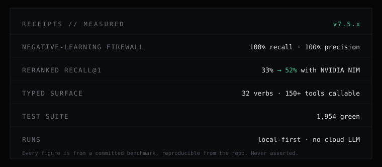

<p align="center">
  
</p>

<p align="center">
  
</p>

<p align="center">
  <a href="https://www.npmjs.com/package/wyrm-mcp"></a>
  <a href="https://www.npmjs.com/package/wyrm-mcp"></a>
  <a href="#requirements"></a>
  
  
  
</p>

<p align="center">
  <b>Persistent memory for AI agents, over MCP.</b><br/>
  Ground truths, recorded failures that block repeats, decision causality, and hybrid recall.<br/>
  A structured SQLite memory on your machine. No cloud, no separate LLM.
</p>

<p align="center">
  <a href="https://ghosts.lk/wyrm">Website</a> ·
  <a href="#quickstart">Quickstart</a> ·
  <a href="https://github.com/Ghosts-Protocol-Pvt-Ltd/wyrm-mcp/discussions">Discussions</a> ·
  <a href="CHANGELOG.md">Changelog</a>
</p>

---

## What it is

Most AI coding sessions start from zero. Wyrm gives the agent a memory that persists across them. It keeps your project's decisions, conventions, open work, and dead-ends in a structured database on your own machine, and hands them back to the model at the start of the next session. An agent connected to Wyrm recalls what was decided last week instead of re-deriving it, and can be stopped from repeating an approach that already failed.

It speaks the Model Context Protocol, so it drops into Claude, Cursor, Copilot, Windsurf, and Codex without glue code.

## Quickstart

```bash
npm install -g wyrm-mcp   # install
wyrm-setup                # wire it into your AI clients, then restart them
```

Then, from inside your client, ask it to call `wyrm_capabilities` to confirm the connection. The everyday loop is four steps the agent runs on its own once the habit sets in:

```
prime    →  load the project's truths, quests, and dead-ends at session start
recall   →  retrieve what you know before re-deriving it
check    →  before retrying an approach, ask if it already failed
capture  →  store durable facts, lessons, and tasks as you go
```

## Measured, not asserted

<p align="center">
  
</p>

Every number Wyrm publishes comes from a benchmark committed to the source, reproducible on your own data. The negative-learning firewall and the recall lift are the two that matter most, and both are covered below.

## Why Wyrm

### It remembers what failed, not just what worked

Most memory tools store successes. Wyrm also records dead-ends and blocks the repeat. You record a failed approach with `wyrm_failure_record`, and a later `wyrm_failure_check` surfaces it before the agent walks back into it. Across a session that stops re-litigating solved problems; across a fleet of agents, one worker's dead-end warns the rest, once.

### Recall that finds things by meaning, not just keywords

`wyrm_recall` runs keyword search (FTS5) and semantic search over a vector index, fuses them, and reranks. It is hybrid by default, no configuration required. For higher accuracy you can opt into NVIDIA NIM retrieval (below).

### Local-first, and honest about egress

By default nothing leaves your machine. The database is a single SQLite file at `~/.wyrm/wyrm.db`. When you do opt into a hosted embedding path, Wyrm reports exactly what left and where, in a determinism receipt and on its health endpoint. The privacy claim is one you can verify from the runtime, not just the docs.

### Built for one agent or a fleet

Every memory is attributed to the agent and run that produced it, so a swarm of agents can share one accountable memory bus, with failures kept private to your account by default. A live event stream keeps devices in sync.

## NVIDIA NIM retrieval (optional)

Wyrm can use NVIDIA NIM for embeddings and reranking when accuracy is worth a hosted call. On a retrieval benchmark committed in the repo, recall@1 moved from 33% on the local baseline to 47% with NIM embeddings and 52% with NIM reranking added. It is an explicit opt-in, off by default, and the egress is disclosed on every call.

```bash
export WYRM_VECTOR_PROVIDER=nim
export WYRM_RERANK_PROVIDER=nim
export NIM_API_KEY=nvapi-...
```

<sub>Ghost Protocol (Pvt) Ltd is a member of NVIDIA Inception.</sub>

## Works with

Claude (Code, desktop, web) · Cursor · GitHub Copilot · Windsurf · Codex, and any MCP-capable client.

## Requirements

Node.js 22 or newer. Optional: a local Ollama with `nomic-embed-text` for semantic recall without any hosted call.

## Community and feedback

Wyrm sends no telemetry, so the way we learn what is working is you telling us.

- **`wyrm feedback`** from your terminal opens a prefilled report. Add `--bug`, `--idea`, or `--question`.
- **[Discussions](https://github.com/Ghosts-Protocol-Pvt-Ltd/wyrm-mcp/discussions)** for questions, ideas, and how it is going.
- **[Issues](https://github.com/Ghosts-Protocol-Pvt-Ltd/wyrm-mcp/issues)** for bugs and concrete requests.
- Email [ryan@ghosts.lk](mailto:ryan@ghosts.lk).

If Wyrm earned a place in your workflow, a star helps other people find it.

## License

Wyrm is proprietary software, free to use under the [Wyrm license](LICENSE) and Terms of Service. This repository is the public home for the docs, the changelog, and the community. The source is not published here. For a commercial license (embedding Wyrm in a closed product, or running it as a managed service), contact [ryan@ghosts.lk](mailto:ryan@ghosts.lk).

<br/>

<p align="center">
  <sub>Built by <a href="https://ghosts.lk">Ghost Protocol</a> · Colombo, Sri Lanka</sub><br/>
  <sub>NVIDIA, the NVIDIA logo, and NVIDIA Inception are trademarks and/or registered trademarks of NVIDIA Corporation.</sub>
</p>
