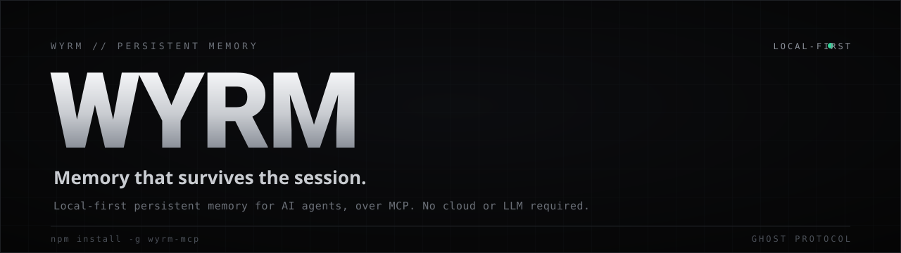

<p align="center">
  
</p>

<p align="center">
  
</p>
  <a href="https://www.npmjs.com/package/wyrm-mcp"></a>
  <a href="https://www.npmjs.com/package/wyrm-mcp"></a>
  <a href="#requirements"></a>
  
  
  
</p>

<p align="center">
  <b>Persistent memory for AI agents, over MCP.</b><br/>
  Ground truths, recorded failures that block repeats, decision causality, and hybrid recall.<br/>
  A structured SQLite memory on your machine. No cloud, no separate LLM.
</p>

<p align="center">
  <a href="https://ghosts.lk/wyrm">Website</a> ·
  <a href="#quickstart">Quickstart</a> ·
  <a href="https://github.com/Ghosts-Protocol-Pvt-Ltd/wyrm-mcp/discussions">Discussions</a> ·
  <a href="CHANGELOG.md">Changelog</a>
</p>

---

## What it is

Most AI coding sessions start from zero. Wyrm gives the agent a memory that persists across them. It keeps your project's decisions, conventions, open work, and dead-ends in a structured database on your own machine, and hands them back to the model at the start of the next session. An agent connected to Wyrm recalls what was decided last week instead of re-deriving it, and can be stopped from repeating an approach that already failed.

It speaks the Model Context Protocol, so it drops into Claude, Cursor, Copilot, Windsurf, and Codex without glue code.

## Quickstart

```bash
npm install -g wyrm-mcp   # install
wyrm-setup                # wire it into your AI clients, then restart them
```

> **On npm v12+**, npm denies dependency install scripts by default, which skips `better-sqlite3`'s native build — the install *succeeds* but `wyrm` then fails with *"Could not locate the bindings file"*. Install with the build allow-listed instead: `npm install -g wyrm-mcp --allow-scripts=wyrm-mcp,better-sqlite3` (`wyrm update` already does this for you). See [TROUBLESHOOTING.md](https://github.com/Ghosts-Protocol-Pvt-Ltd/wyrm-mcp/blob/HEAD/TROUBLESHOOTING.md).

Then, from inside your client, ask it to call `wyrm_capabilities` to confirm the connection. The everyday loop is four steps the agent runs on its own once the habit sets in:

```
prime    →  load the project's truths, quests, and dead-ends at session start
recall   →  retrieve what you know before re-deriving it
check    →  before retrying an approach, ask if it already failed
capture  →  store durable facts, lessons, and tasks as you go
```

## Measured, not asserted

Every number Wyrm publishes comes from a benchmark committed to the source, reproducible on your own data. The negative-learning firewall and the recall lift are the two that matter most, and both are covered below.

### The Firewall Receipt

The receipt is the measured proof of one claim: when a failure is on record, the firewall blocks the repeat, stays silent on novel actions, and drops the block once the anchored source drifts, deterministically and with no model in the loop. On wyrm-mcp 9.1.2, measured 2026-09-12, the deterministic bench scores recall 100% (32/32) on same-action and reworded repeats with precision 100% (0 false blocks of 16), and in the blind agent A/B the repeated-failure rate falls from 38.9% (14/36) to 8.3% (3/36), a 78.6% relative reduction with a bootstrap 95% CI of 45.5% to 100% (n=36 per arm). The method, the per-scenario table and the two limits the numbers carry are in [docs/firewall-receipt.md](docs/firewall-receipt.md); the deterministic receipt is regenerated on every push in CI as the artifact `firewall-receipt-node22.x` ([workflow](https://github.com/Ghosts-Protocol-Pvt-Ltd/wyrm-mcp/actions/workflows/ci.yml)).

The failure firewall in twenty seconds: a failure is on record, the agent proposes the same deploy, and the PreToolUse hook refuses it with the recorded reason before the command runs. A variant with an added flag gets an advisory, not a block, which is the honest edge of the deterministic match. Every line in the clip is real hook output.


## Why Wyrm

### It remembers what failed, not just what worked

Most memory tools store successes. Wyrm also records dead-ends and blocks the repeat. You record a failed approach with `wyrm_failure_record`, and a later `wyrm_failure_check` surfaces it before the agent walks back into it. Across a session that stops re-litigating solved problems; across a fleet of agents, one worker's dead-end warns the rest, once.

### Recall that finds things by meaning, not just keywords

`wyrm_recall` runs keyword search (FTS5) and semantic search over a vector index, fuses them, and reranks. It is hybrid by default, no configuration required, no account, and no hosted call: a small local embedding model downloads automatically the first time you run `wyrm-setup`. It also weighs recency, temporal cues, and confirmed reuse, so the memory that fits the moment ranks first. On a real-set LoCoMo benchmark committed in the repo, the deterministic no-LLM floor is recall@5 52.4% / recall@10 59.9%, and the bundled local model lifts that to recall@5 60.0% / recall@10 72.0% (in line with the published local-hybrid reference of 60.3% / 72.2%, see BENCHMARKS.md). For maximum accuracy, `wyrm upgrade` moves to hosted NVIDIA NIM retrieval (below).

### Local-first, and honest about egress

By default no memory data leaves your machine. The database is a single SQLite file at `~/.wyrm/wyrm.db`. The only default outbound calls are a daily npm version poll and, on installs with a license key, a signed revocation-list fetch — both off with `WYRM_NO_VERSION_CHECK=1` and `WYRM_LICENSE_REFRESH=0` respectively; the free tier's one-time model download is a plain fetch that sends nothing. `docs/EGRESS.md` in the repository enumerates every destination, and if you find an outbound call that is not on that table, that is a bug worth reporting. When you do opt into a hosted embedding path, Wyrm reports exactly what left and where, in a determinism receipt and on its health endpoint. The privacy claim is one you can verify from the runtime, not just the docs.

### Every write leaves a receipt

Every memory write returns a structured receipt that says what happened to it: stored, queued for review, merged, aliased, or dropped, and why. The receipts are ledgered too, so `wyrm digest --writes` reconstructs a day's writes offline and `wyrm_stats` shows the outcomes and the review-queue depth. You can audit what the agent actually committed to memory, not just trust that it did.

### Built for one agent or a fleet

Every memory is attributed to the agent and run that produced it, so a swarm of agents can share one accountable memory bus, with failures kept private to your account by default. A live event stream keeps devices in sync.

### Untrusted input stays out of the context brief

Every artifact is tagged with where it came from: you, an agent, an import, or an untrusted source. Content on the untrusted lane is categorically withheld from the context briefs the model reads, whatever it contains, and imported content is detector-gated and marked. The brief-surface quarantine was hardened against a full garak red-team of 622 real jailbreak payloads: zero escapes from the untrusted lane by construction, and the detector flagged 80.7% of the rest with zero false positives on benign prose. That red-team runs as a CI gate.

## NVIDIA NIM retrieval (optional)

Local vectors are on by default. NIM is the further step up, for embeddings and reranking, when accuracy is worth a hosted call. On the LoCoMo retrieval benchmark committed in the repo (2 conversations, k=10, measured September 2026), the default NIM embedding model `nvidia/nemotron-3-embed-1b` reached recall@1 39.9% and recall@10 76.7%; adding the NIM reranker (`nvidia/llama-nemotron-rerank-vl-1b-v2`) raised recall@1 to 55.5% across the same 301 questions, at about one extra second per query. Figures published here earlier were measured on models NVIDIA retired on 25 August 2026, and have been withdrawn. It is an explicit opt-in, off by default, and the egress is disclosed on every call.

The guided path is `wyrm upgrade`: a free API key, masked key entry, a live call to validate the key before anything is written, and an optional one-time reindex of existing memories on the new tier. To configure it by hand instead:

```bash
export WYRM_VECTOR_PROVIDER=nim
export WYRM_RERANK_PROVIDER=nim
export NVIDIA_API_KEY=nvapi-...
```

<sub>Ghost Protocol (Pvt) Ltd is a member of NVIDIA Inception.</sub>

## Works with

Claude (Code, desktop, web) · Cursor · GitHub Copilot · Windsurf · Codex, and any MCP-capable client.

## Requirements

Node.js 22 or newer. Semantic recall is on by default via a small bundled local model (`wyrm-setup` downloads it, no account needed); `wyrm upgrade` adds hosted NVIDIA NIM retrieval for maximum accuracy. Already running Ollama for this? Existing setups keep working unchanged.

## Pricing

Wyrm is **free to use forever** — the local memory, the firewall, the recall, all of it. Paid plans add cloud sync across devices, encrypted snapshots, shared team memory, and support:

- **Pro** — $29/mo · cloud sync, encrypted snapshots, analytics, priority support
- **Team** — $199/mo · shared team memory, up to 25 seats, admin dashboard
- **Enterprise** — $499/mo · unlimited seats, SSO/SAML, custom SLA, on-premise option

Plans and self-serve checkout: **[account.ghosts.lk/pricing](https://ghosts.lk/pricing)**. Custom or on-premise, email [ryan@ghosts.lk](mailto:ryan@ghosts.lk).

## Community and feedback

Wyrm sends no telemetry, so the way we learn what is working is you telling us.

- **`wyrm feedback`** from your terminal opens a prefilled report. Add `--bug`, `--idea`, or `--question`.
- **[Discussions](https://github.com/Ghosts-Protocol-Pvt-Ltd/wyrm-mcp/discussions)** for questions, ideas, and how it is going.
- **[Issues](https://github.com/Ghosts-Protocol-Pvt-Ltd/wyrm-mcp/issues)** for bugs and concrete requests.
- Email [ryan@ghosts.lk](mailto:ryan@ghosts.lk).

If Wyrm earned a place in your workflow, a star helps other people find it.

## License

Wyrm is proprietary software, free to use under the [Wyrm license](LICENSE) and Terms of Service. This repository is the public home for the docs, the changelog, and the community. The source is not published here. For a commercial license (embedding Wyrm in a closed product, or running it as a managed service), contact [ryan@ghosts.lk](mailto:ryan@ghosts.lk).

<br/>

<p align="center">
  <sub>Built by <a href="https://ghosts.lk">Ghost Protocol</a> · Colombo, Sri Lanka</sub><br/>
  <sub>NVIDIA, the NVIDIA logo, and NVIDIA Inception are trademarks and/or registered trademarks of NVIDIA Corporation.</sub>
</p>
